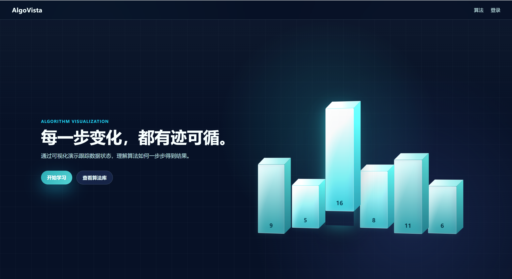
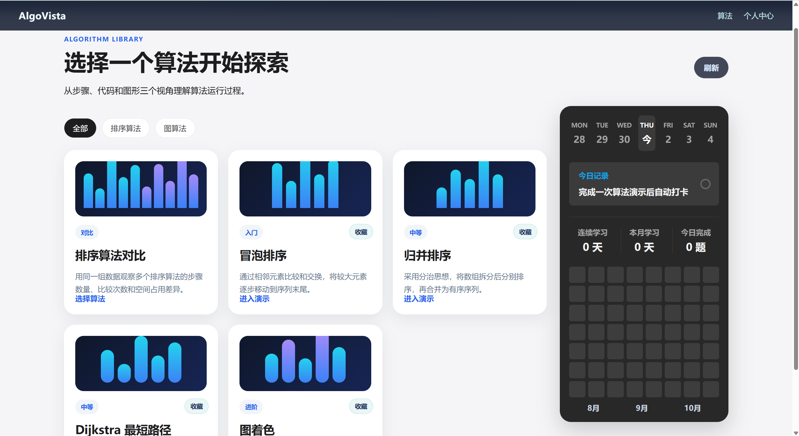
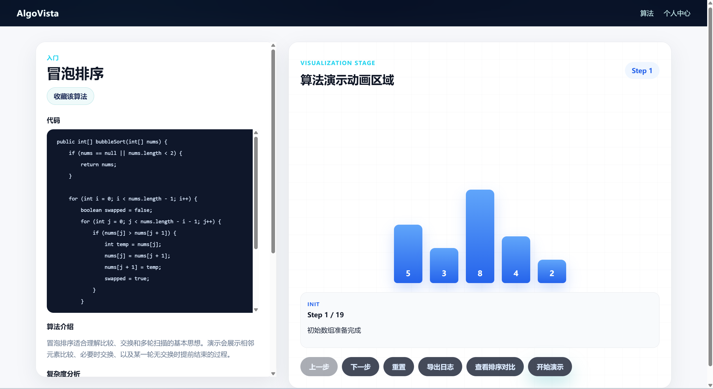
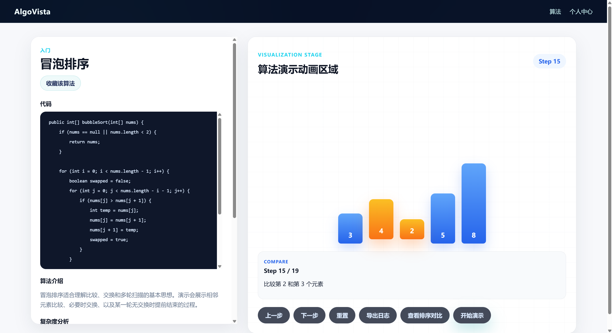
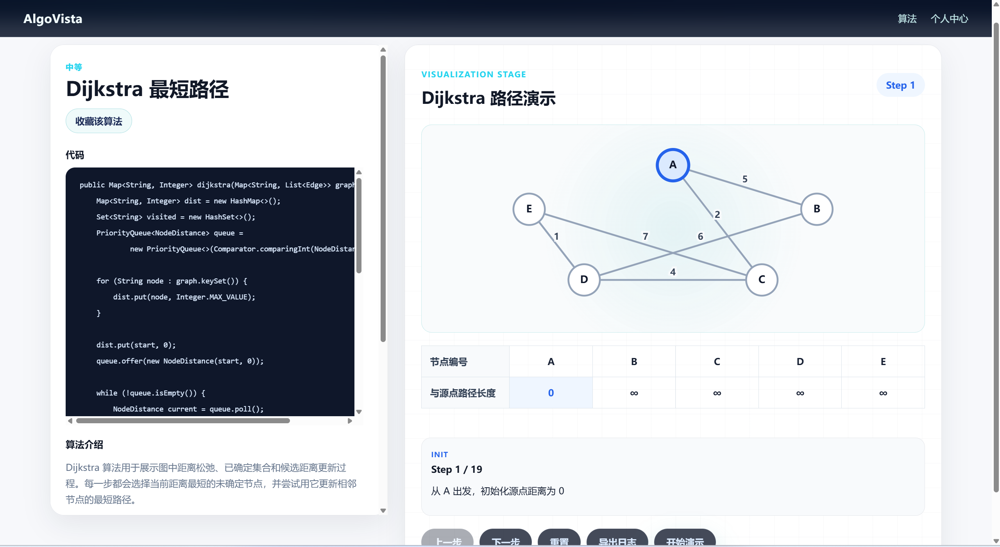
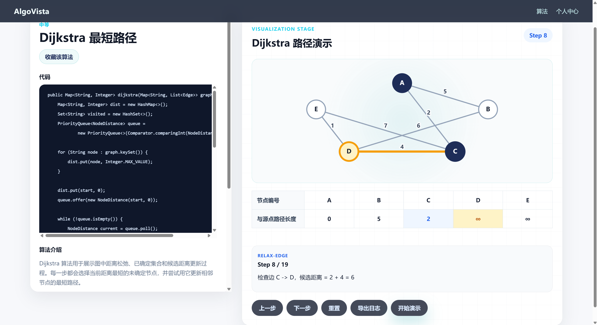

<div align="center">

# AlgoVista

### 算法过程可视化学习平台

**每一步变化，都有迹可循。**

通过步骤、代码和图形，理解算法如何一步步得到结果。

Vue 3 · TypeScript · Spring Boot · MyBatis-Plus · MySQL

[项目预览](#项目预览) · [功能介绍](#功能介绍) · [本地运行](#本地运行) · [项目结构](#项目结构)

</div>



## 项目介绍

AlgoVista 是一个面向算法初学者和算法课程学习的 Web 平台。它将算法执行过程拆分为可逐步查看的状态，让学习者一边阅读参考代码，一边观察数组或图结构的变化，并通过文字说明理解当前步骤的含义。

项目采用前后端分离架构，目前涵盖排序算法与图算法，支持手动单步查看、自动演示、排序算法对比，以及收藏和学习记录管理。

## 功能介绍

| 功能 | 说明 |
| --- | --- |
| 算法库 | 按排序算法、图算法分类浏览，查看难度和算法简介 |
| 过程可视化 | 使用柱状图、节点和边呈现执行状态，突出当前比较或处理的对象 |
| 演示控制 | 支持上一步、下一步、重置和自动演示 |
| 算法详情 | 展示参考代码、算法说明、时间复杂度与空间复杂度 |
| 排序对比 | 使用同一组数据观察不同排序算法的步骤、比较次数和空间占用差异 |
| 学习管理 | 支持算法收藏、学习记录、学习日历与统计 |
| 用户账户 | 注册、登录、退出及 Session 鉴权 |
| 日志导出 | 导出演示日志，便于复盘算法执行过程 |

### 已支持的算法

| 分类 | 算法 | 学习重点 |
| --- | --- | --- |
| 排序算法 | 冒泡排序 | 相邻元素比较、交换、多轮扫描与提前结束 |
| 排序算法 | 归并排序 | 递归拆分、分治思想与有序合并 |
| 图算法 | Dijkstra 最短路径 | 节点选择、距离松弛与最短距离更新 |
| 图算法 | 图着色 | 颜色分配、相邻节点冲突检查与回溯 |

## 项目预览

### 算法库与学习日历

通过分类筛选选择算法，查看算法卡片与学习情况，进入演示或选择排序算法进行对比。



### 冒泡排序：从初始化到逐步比较

左侧展示参考代码和算法介绍，右侧展示数组状态、步骤编号和操作说明。通过单步控制，可以观察每次比较与交换如何改变数组。



当前比较的元素会被突出显示，帮助对应文字说明与数组中的实际位置。



### Dijkstra：观察距离松弛过程

图结构展示节点、边与权重，距离表同步展示从源点到各节点的当前距离。



随着演示推进，当前处理的节点与边会被突出显示，步骤说明给出候选距离的计算过程。



## 技术栈

| 层级 | 技术 |
| --- | --- |
| 前端 | Vue 3、TypeScript、Vite 6、Vue Router、Pinia、Axios |
| 后端 | Java 21、Spring Boot 3.3.6、MyBatis-Plus 3.5.9 |
| 数据库 | MySQL 8.0+ |
| 认证 | Session、Spring Security Crypto |
| 构建 | Maven、npm |

## 本地运行

### 1. 准备环境

安装 JDK 21、Maven 3.8+、Node.js 20.19+（或 22.12+）和 MySQL 8.0+。以下命令从项目根目录执行；前后端需要分别运行在两个终端中。

### 2. 创建数据库

启动 MySQL，执行：

```sql
CREATE DATABASE IF NOT EXISTS algovista
  DEFAULT CHARACTER SET utf8mb4
  COLLATE utf8mb4_unicode_ci;
```

### 3. 配置数据库连接

复制本地配置模板。Windows PowerShell：

```powershell
Copy-Item backend/src/main/resources/application-local.example.yml backend/src/main/resources/application-local.yml
```

macOS / Linux：

```bash
cp backend/src/main/resources/application-local.example.yml backend/src/main/resources/application-local.yml
```

编辑 `backend/src/main/resources/application-local.yml`，将数据库地址、用户名和密码改为本机配置：

```yaml
spring:
  datasource:
    url: jdbc:mysql://localhost:3306/algovista?useUnicode=true&characterEncoding=utf8&serverTimezone=Asia/Shanghai&allowPublicKeyRetrieval=true&useSSL=false
    username: root
    password: "你的数据库密码"
    driver-class-name: com.mysql.cj.jdbc.Driver

app:
  cors:
    allowed-origins:
      - http://localhost:5173
```

后端默认启用 `local` 配置，启动时通过 `schema.sql` 和 `data.sql` 初始化表结构与示例算法数据。本地配置文件已加入 `.gitignore`。

### 4. 启动后端

```bash
cd backend
mvn spring-boot:run
```

后端地址：<http://localhost:8080>。

### 5. 启动前端

在另一个终端，从项目根目录执行：

```bash
cd frontend
npm install
npm run dev
```

打开 <http://localhost:5173> 即可访问。前端通过 Vite 将 `/api` 请求代理到 `http://localhost:8080`。

如果 PowerShell 阻止执行 `npm.ps1`，使用 `npm.cmd install` 和 `npm.cmd run dev`。

## 项目结构

```text
.
├── backend/
│   ├── pom.xml                     # 后端依赖与构建配置
│   └── src/
│       ├── main/
│       │   ├── java/com/algovista/  # 认证、算法、可视化、收藏与学习记录
│       │   └── resources/
│       │       ├── application.yml
│       │       ├── application-local.example.yml
│       │       ├── schema.sql      # 数据库表结构
│       │       └── data.sql        # 示例算法数据
│       └── test/                   # 后端测试
├── frontend/
│   ├── package.json
│   ├── vite.config.ts              # 开发服务与 API 代理
│   └── src/
│       ├── api/                    # 接口封装
│       ├── router/                 # 页面路由
│       ├── stores/                 # 状态管理
│       └── views/                  # 首页、算法库、演示、对比与个人中心
├── 首页.png                        # 项目展示截图
├── 第一页.png
├── 算法演示01.png
├── 算法演示01_1.png
├── 算法演示02_1.png
├── 算法演示02_2.png
└── README.md
```

## 测试与构建

后端测试，在 `backend` 目录执行：

```bash
mvn test
```

前端类型检查与生产构建，在 `frontend` 目录执行：

```bash
npm run build
```

前端本地预览生产构建：

```bash
npm run preview
```

## 常见问题

| 问题 | 排查方式 |
| --- | --- |
| 前端出现 `ECONNREFUSED` 或代理错误 | 确认后端已启动，且监听 `8080` 端口 |
| 后端无法连接 MySQL | 检查 MySQL 服务、数据库名称及本地配置中的账号密码 |
| `java`、`mvn` 或 `npm` 命令不可用 | 检查对应环境是否安装，并加入系统 `PATH` |
| Maven 下载依赖失败 | 检查网络和 Maven 镜像设置；自定义本地仓库路径应使用当前机器的可写目录 |
| 登录状态无法保持 | 使用 `http://localhost:5173` 访问，检查 Cookie 和后端允许的来源配置 |
| 中文显示乱码 | 确保数据库使用 `utf8mb4`，SQL 和配置文件使用 UTF-8 编码 |

## 扩展开发

新增算法时，可按以下步骤接入：

1. 在数据库中补充算法元数据、说明、参考代码与复杂度信息。
2. 在后端可视化服务中实现执行步骤生成逻辑。
3. 在前端算法详情页中适配数组或图结构的展示。
4. 如需参与排序对比，补充对比页面中的算法接入与统计。

修改表结构或示例数据时，请同步更新 `schema.sql` 和 `data.sql`。

## 后续改进方向

以下内容为后续规划，尚未全部实现。

| 方向 | 计划内容 |
| --- | --- |
| 扩充算法库 | 增加快速排序、堆排序、二分查找、BFS、DFS 和动态规划等演示 |
| 自定义输入 | 支持输入数组、编辑图结构与边权，并提供输入校验和示例数据 |
| 演示体验 | 增加播放速度调节、步骤定位、执行代码高亮和关键状态说明 |
| 对比分析 | 扩展算法对比，展示不同输入规模下的操作次数和资源占用 |
| 学习路径 | 按知识点和难度组织课程、练习与复习计划 |
| 工程质量 | 补充核心算法测试、接口测试与持续集成，完善部署说明 |

### 智能体接入与扩展

计划在现有算法演示基础上接入智能体，让学习者围绕当前算法、输入数据和执行步骤获得更具体的帮助。

- **算法讲解智能体**：结合当前步骤解释比较、交换、递归和距离松弛等操作，并回答“为什么这样执行”。
- **学习辅导智能体**：根据学习记录和掌握情况推荐算法、练习与复习内容。
- **代码分析智能体**：分析学习者提交的算法代码，提示边界条件、潜在错误及复杂度问题。
- **练习反馈智能体**：生成与当前知识点相关的练习，提供分层提示和解题反馈。
- **知识检索智能体**：检索项目中的算法说明与参考资料，为回答提供可追溯的依据。

接入时优先实现“当前步骤问答”，由后端提供统一模型接口，将算法信息、输入数据与步骤状态作为上下文。随后逐步扩展知识检索与学习推荐。模型密钥保存在服务端，通过环境变量配置；代码执行场景使用隔离环境，并设置调用超时和资源限制。
